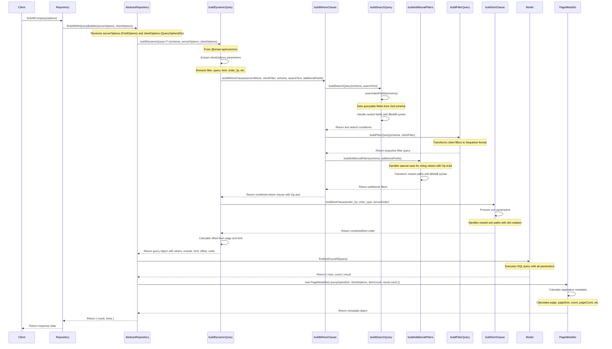

# FindAll Sequence Diagram

The following diagram illustrates the flow of the `findAllWithQueryBuilder` method in the AbstractRepository class.

## Key Components

1. **Repository Layer**: Custom repository classes that extend AbstractRepository
2. **AbstractRepository**: Provides common data access methods including findAllWithQueryBuilder
3. **buildDynamicQuery**: Utility from @smart-api/common that constructs Sequelize query options
4. **Model**: Sequelize model that performs the actual database query
5. **PageMetaDto**: Creates pagination metadata based on results

## Handling Nested Properties

The diagram shows how dot notation in client filters (like 'user.profile.role') is properly handled throughout the query building process, as noted in the buildFilterQuery and buildAdditionalFilters steps.
