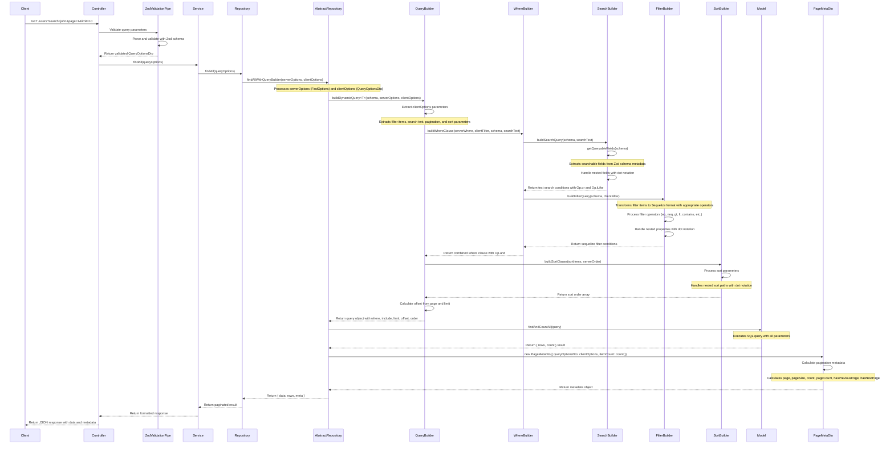

# FindAll Sequence Diagram

The following diagram illustrates the flow of the `findAllWithQueryBuilder` method in the AbstractRepository class of the Smart API server package.

## Key Components

1. **Controller Layer**: Handles HTTP requests and uses ZodValidationPipe for request validation
2. **Service Layer**: Contains business logic and calls repository methods
3. **Repository Layer**: Custom repository classes that extend AbstractRepository
4. **AbstractRepository**: Provides common data access methods including findAllWithQueryBuilder
5. **QueryBuilder**: Constructs Sequelize query options from client parameters
6. **WhereBuilder**: Builds WHERE clauses for filtering and searching
7. **SearchBuilder**: Handles text search across multiple fields
8. **FilterBuilder**: Processes filter conditions with various operators
9. **SortBuilder**: Handles sorting by multiple fields
10. **Model**: Sequelize model that performs the actual database query
11. **PageMetaDto**: Creates pagination metadata based on results

## Handling Nested Properties

The Smart API server package provides robust support for working with nested properties:

1. **Dot Notation**: Client can use dot notation (e.g., 'user.profile.role') in filters and sort parameters
2. **Circular References**: The system properly handles circular references between related entities
3. **Relationship Types**: Supports various relationship types (1:1, 1:Many, Many:Many)
4. **Case-Insensitive Search**: Implements case-insensitive search across nested properties

## Zod Schema Integration

The sequence diagram shows how Zod schemas are used throughout the process:

1. **Request Validation**: ZodValidationPipe validates incoming request parameters
2. **Field Discovery**: Queryable fields are extracted from schema metadata
3. **Type Safety**: The entire process maintains type safety from request to response
